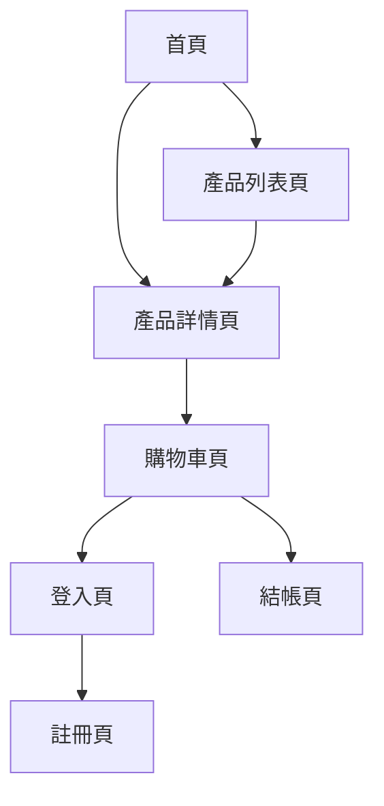

## 1. 產品概述
這是一個專門銷售衛衣的電商網站，提供產品展示和購物車功能。未來將支援付費功能。

目標用戶是想要購買時尚衛衣的消費者，透過直觀的介面展示商品並提供便捷的購物體驗。

## 2. 核心功能

### 2.1 用戶角色
| 角色 | 註冊方式 | 核心權限 |
|------|----------|----------|
| 訪客 | 無需註冊 | 瀏覽商品、加入購物車 |
| 註冊用戶 | 電子郵件註冊 | 結帳、查看訂單歷史、管理收貨地址 |

### 2.2 功能模組
網站包含以下主要頁面：
1. **首頁**：產品輪播、熱門商品展示、導航菜單
2. **產品列表頁**：商品篩選、排序、分類瀏覽
3. **產品詳情頁**：商品圖片展示、尺碼選擇、加入購物車
4. **購物車頁**：商品管理、數量調整、總價計算
5. **登入註冊頁**：用戶身份驗證

### 2.3 頁面詳情
| 頁面名稱 | 模組名稱 | 功能描述 |
|-----------|-------------|-------------|
| 首頁 | 輪播圖 | 自動切換展示主打衛衣款式，支援手動切換 |
| 首頁 | 熱門商品 | 展示銷量最高的6件衛衣，點擊進入詳情頁 |
| 首頁 | 導航欄 | 包含品牌Logo、商品分類、購物車圖標、用戶登入入口 |
| 產品列表頁 | 篩選器 | 按顏色、尺碼、價格區間篩選商品 |
| 產品列表頁 | 商品網格 | 網格佈局展示商品縮略圖、名稱、價格 |
| 產品詳情頁 | 圖片展示 | 多角度商品圖片，支援放大查看細節 |
| 產品詳情頁 | 尺碼選擇 | 提供S/M/L/XL尺碼選項，顯示庫存狀態 |
| 產品詳情頁 | 加入購物車 | 選擇尺碼和數量後添加到購物車 |
| 購物車頁 | 商品列表 | 顯示已添加商品的圖片、名稱、單價、數量 |
| 購物車頁 | 數量調整 | 增加或減少商品數量，即時更新總價 |
| 購物車頁 | 刪除商品 | 從購物車中移除不需要的商品 |
| 登入註冊頁 | 登入表單 | 輸入電子郵件和密碼進行身份驗證 |
| 登入註冊頁 | 註冊表單 | 填寫電子郵件、密碼、姓名創建新帳戶 |

## 3. 核心流程
### 用戶購物流程
用戶從首頁瀏覽商品，可以查看產品詳情，選擇合適的尺碼和數量，將商品加入購物車。在購物車中可以管理商品，最終進行結帳（目前為模擬結帳流程）。

### 頁面導航流程

## 4. 用戶介面設計
### 4.1 設計風格
- **主色調**：深藍色 (#1a365d) 作為主色，白色 (#ffffff) 作為背景色
- **強調色**：橙色 (#ff6b35) 用於按鈕和重要操作
- **按鈕樣式**：圓角矩形設計，hover時有輕微陰影效果
- **字體**：系統默認字體，標題使用粗體，正文字體大小16px
- **佈局風格**：卡片式佈局，簡潔現代的電商風格
- **圖標**：使用簡潔的線性圖標，購物車和用戶圖標清晰易辨識

### 4.2 頁面設計概述
| 頁面名稱 | 模組名稱 | UI元素 |
|-----------|-------------|-------------|
| 首頁 | 輪播圖 | 全寬設計，高度400px，自動播放間隔5秒，底部有指示器 |
| 首頁 | 商品展示 | 響應式網格，桌面端4列，平板2列，手機1列，卡片間距20px |
| 產品詳情頁 | 圖片區域 | 左側大圖展示，右側小圖預覽，點擊小圖切換大圖 |
| 產品詳情頁 | 資訊區域 | 商品名稱使用24px粗體，價格使用20px橙色字體 |
| 購物車頁 | 商品卡片 | 每個商品水平排列，包含80x80px圖片，名稱、單價、數量選擇器 |

### 4.3 響應式設計
採用桌面端優先設計，支援平板和手機自適應。觸控優化包括：
- 按鈕點擊區域最小44px
- 圖片支援手勢縮放
- 購物車圖標在移動端固定在右下角