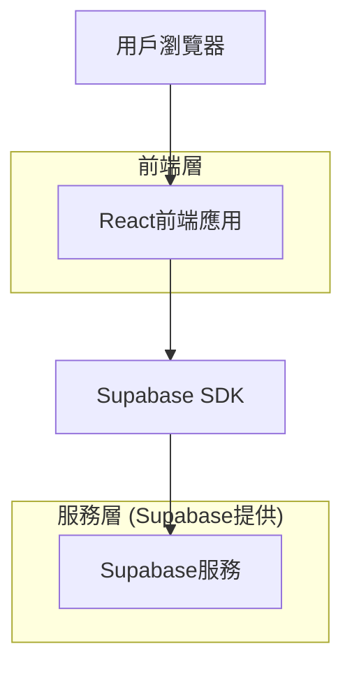

## 1. 架構設計



## 2. 技術描述

* **前端**: React\@18 + tailwindcss\@3 + vite

* **初始化工具**: vite-init

* **後端**: Supabase (提供認證、資料庫、儲存服務)

* **主要依賴**:

  * @supabase/supabase-js (Supabase客戶端)

  * react-router-dom (路由管理)

  * lucide-react (圖標庫)

## 3. 路由定義

| 路由            | 用途               |
| ------------- | ---------------- |
| /             | 首頁，展示輪播圖和熱門商品    |
| /products     | 產品列表頁，顯示所有衛衣商品   |
| /products/:id | 產品詳情頁，展示單個商品詳細資訊 |
| /cart         | 購物車頁，管理已選商品      |
| /login        | 登入頁，用戶身份驗證       |
| /register     | 註冊頁，創建新用戶帳戶      |
| /checkout     | 結帳頁（目前為模擬結帳）     |

## 4. 資料模型

### 4.1 資料模型定義

```mermaid
erDiagram
  USERS ||--o{ CART_ITEMS : contains
  USERS ||--o{ ORDERS : places
  PRODUCTS ||--o{ CART_ITEMS : included_in
  PRODUCTS ||--o{ ORDER_ITEMS : included_in
  ORDERS ||--o{ ORDER_ITEMS : contains

  USERS {
    uuid id PK
    string email UK
    string password_hash
    string name
    timestamp created_at
    timestamp updated_at
  }
  
  PRODUCTS {
    uuid id PK
    string name
    text description
    decimal price
    json images
    json sizes
    integer stock_quantity
    string category
    timestamp created_at
    timestamp updated_at
  }
  
  CART_ITEMS {
    uuid id PK
    uuid user_id FK
    uuid product_id FK
    integer quantity
    string selected_size
    timestamp created_at
    timestamp updated_at
  }
  
  ORDERS {
    uuid id PK
    uuid user_id FK
    decimal total_amount
    string status
    json shipping_address
    timestamp created_at
    timestamp updated_at
  }
  
  ORDER_ITEMS {
    uuid id PK
    uuid order_id FK
    uuid product_id FK
    integer quantity
    decimal unit_price
    string selected_size
    timestamp created_at
  }
```



### 4.2 資料定義語言

用戶表 (users)

```sql
-- 創建表
CREATE TABLE users (
    id UUID PRIMARY KEY DEFAULT gen_random_uuid(),
    email VARCHAR(255) UNIQUE NOT NULL,
    password_hash VARCHAR(255) NOT NULL,
    name VARCHAR(100) NOT NULL,
    created_at TIMESTAMP WITH TIME ZONE DEFAULT NOW(),
    updated_at TIMESTAMP WITH TIME ZONE DEFAULT NOW()
);

-- 創建索引
CREATE INDEX idx_users_email ON users(email);
```

商品表 (products)

```sql
-- 創建表
CREATE TABLE products (
    id UUID PRIMARY KEY DEFAULT gen_random_uuid(),
    name VARCHAR(255) NOT NULL,
    description TEXT,
    price DECIMAL(10,2) NOT NULL,
    images JSONB DEFAULT '[]',
    sizes JSONB DEFAULT '[]',
    stock_quantity INTEGER DEFAULT 0,
    category VARCHAR(50) DEFAULT 'hoodie',
    created_at TIMESTAMP WITH TIME ZONE DEFAULT NOW(),
    updated_at TIMESTAMP WITH TIME ZONE DEFAULT NOW()
);

-- 創建索引
CREATE INDEX idx_products_category ON products(category);
CREATE INDEX idx_products_price ON products(price);
```

購物車項目表 (cart\_items)

```sql
-- 創建表
CREATE TABLE cart_items (
    id UUID PRIMARY KEY DEFAULT gen_random_uuid(),
    user_id UUID REFERENCES users(id) ON DELETE CASCADE,
    product_id UUID REFERENCES products(id) ON DELETE CASCADE,
    quantity INTEGER NOT NULL DEFAULT 1,
    selected_size VARCHAR(10) NOT NULL,
    created_at TIMESTAMP WITH TIME ZONE DEFAULT NOW(),
    updated_at TIMESTAMP WITH TIME ZONE DEFAULT NOW(),
    UNIQUE(user_id, product_id, selected_size)
);

-- 創建索引
CREATE INDEX idx_cart_items_user_id ON cart_items(user_id);
CREATE INDEX idx_cart_items_product_id ON cart_items(product_id);
```

訂單表 (orders)

```sql
-- 創建表
CREATE TABLE orders (
    id UUID PRIMARY KEY DEFAULT gen_random_uuid(),
    user_id UUID REFERENCES users(id) ON DELETE CASCADE,
    total_amount DECIMAL(10,2) NOT NULL,
    status VARCHAR(50) DEFAULT 'pending',
    shipping_address JSONB,
    created_at TIMESTAMP WITH TIME ZONE DEFAULT NOW(),
    updated_at TIMESTAMP WITH TIME ZONE DEFAULT NOW()
);

-- 創建索引
CREATE INDEX idx_orders_user_id ON orders(user_id);
CREATE INDEX idx_orders_status ON orders(status);
```

訂單項目表 (order\_items)

```sql
-- 創建表
CREATE TABLE order_items (
    id UUID PRIMARY KEY DEFAULT gen_random_uuid(),
    order_id UUID REFERENCES orders(id) ON DELETE CASCADE,
    product_id UUID REFERENCES products(id) ON DELETE CASCADE,
    quantity INTEGER NOT NULL,
    unit_price DECIMAL(10,2) NOT NULL,
    selected_size VARCHAR(10) NOT NULL,
    created_at TIMESTAMP WITH TIME ZONE DEFAULT NOW()
);

-- 創建索引
CREATE INDEX idx_order_items_order_id ON order_items(order_id);
CREATE INDEX idx_order_items_product_id ON order_items(product_id);
```

### 4.3 Supabase訪問權限設置

```sql
-- 基本權限設置
GRANT SELECT ON products TO anon;
GRANT ALL PRIVILEGES ON products TO authenticated;

GRANT SELECT ON cart_items TO anon;
GRANT ALL PRIVILEGES ON cart_items TO authenticated;

-- RLS策略示例（行級安全）
ALTER TABLE cart_items ENABLE ROW LEVEL SECURITY;

-- 用戶只能查看和編輯自己的購物車項目
CREATE POLICY "Users can view own cart items" ON cart_items
    FOR SELECT USING (auth.uid() = user_id);

CREATE POLICY "Users can insert own cart items" ON cart_items
    FOR INSERT WITH CHECK (auth.uid() = user_id);

CREATE POLICY "Users can update own cart items" ON cart_items
    FOR UPDATE USING (auth.uid() = user_id);

CREATE POLICY "Users can delete own cart items" ON cart_items
    FOR DELETE USING (auth.uid() = user_id);
```

## 5. 初始化數據

```sql
-- 插入示例商品數據
INSERT INTO products (name, description, price, images, sizes, stock_quantity, category) VALUES
('經典連帽衛衣', '100%純棉材質，舒適透氣，經典版型設計', 899.00, '["hoodie1-main.jpg", "hoodie1-detail.jpg"]', '["S", "M", "L", "XL"]', 50, 'hoodie'),
('潮流印花衛衣', '時尚印花設計，街頭風格，寬鬆版型', 1299.00, '["hoodie2-main.jpg", "hoodie2-detail.jpg"]', '["S", "M", "L", "XL"]', 30, 'hoodie'),
('簡約素色衛衣', '極簡設計，多色可選，日常百搭', 699.00, '["hoodie3-main.jpg", "hoodie3-detail.jpg"]', '["S", "M", "L", "XL"]', 80, 'hoodie');
```

